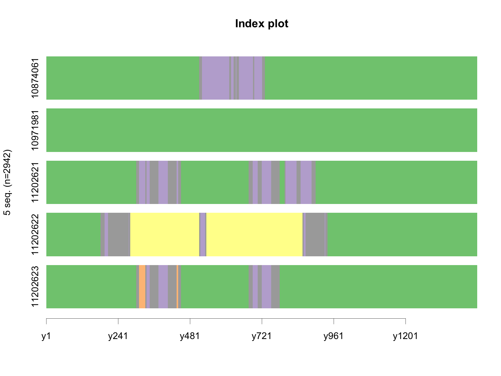

<!-- README.md is generated from README.Rmd. Please edit that file -->
A project examining activity and travel fragmentation in Santa Barbara and SLO counties in California.

Overview
========

The primary goal of this project is to investigate the effects of activity and travel fragmentation on behavior. The current focus of the project is to reorganize and update the previous data analysis scripts. This will allow for future use of this workflow in larger-scale implementation of the analysis.

Useful links:
-------------

-   [Integrating git and Github into an R project](https://happygitwithr.com/)
-   Restructuring principles I will be using can be found in the article [project-oriented workflow.](https://www.tidyverse.org/articles/2017/12/workflow-vs-script/)

Restructuring of scripts
------------------------

We want the project workflow to:

-   Have a clear organizational scheme
-   Have each script be one piece (break down the workflow into small pieces that are each in their own script)
-   Bring over all necessary pieces from the old scripts to the new ones.

TIPS FOR MYSELF (directly from the article [project-oriented workflow.](https://www.tidyverse.org/articles/2017/12/workflow-vs-script/) )

1.  Isolate code that creates an object that takes a long time to create in its own script.
2.  Write the object to file as `.rds`
3.  Scripts developed downstream can just reload the object

I will also be using something relatively new to me: the `here` package. This makes relative path structures much more flexible and is meant to be used within an R project. More info on that can be found [here.](https://github.com/jennybc/here_here)

Eventual goals:

-   Bring Adam's scripts that built the objects I am using into the project.

Project structure (folders, etc)
================================

-   `/R` contains scripts
-   `/figs` contains any figures built
-   `/data` contains the data files we will use and access. Right now, this includes those. However, I am ocnsidering moving the mid-stream files to their own folder.
-   `/results` contains any files that are a final result in themselves, but are not explicitly figures. This would include things like .csv's

Undecided if I will be uploading the folders `/data` and `/results` to GitHub. I need to learn what the best way to deal with data in projects is.

[Data can be found on UCSB Box.](https://ucsb.app.box.com/folder/65485431730)

Flow of the Analysis
--------------------

Run [R/95\_make-all.R](R/95_make-all.R) to re-run the analysis and re-render this README.

<table>
<colgroup>
<col width="24%" />
<col width="37%" />
<col width="38%" />
</colgroup>
<thead>
<tr class="header">
<th>Input</th>
<th>Script</th>
<th>Output</th>
</tr>
</thead>
<tbody>
<tr class="odd">
<td></td>
<td><a href="R/01_01_extract-all-chts-tables_slo-sb.R" class="uri">R/01_01_extract-all-chts-tables_slo-sb.R</a></td>
<td><a href="data/chts-hhids_slo-sb.rds" class="uri">data/chts-hhids_slo-sb.rds</a><br><a href="data/chts-all-tables_slo-sb.rds" class="uri">data/chts-all-tables_slo-sb.rds</a></td>
</tr>
<tr class="even">
<td><a href="data/chts-all-tables_slo-sb.rds" class="uri">data/chts-all-tables_slo-sb.rds</a><br><a href="data/slo_sb_place2segid.rds" class="uri">data/slo_sb_place2segid.rds</a></td>
<td><a href="R/01_02_classify-places-HWSO.R" class="uri">R/01_02_classify-places-HWSO.R</a></td>
<td><a href="figs/place-type-freq-table-HOSW.csv" class="uri">figs/place-type-freq-table-HOSW.csv</a><br><a href="data/locations-place-cat_places.rds" class="uri">data/locations-place-cat_places.rds</a></td>
</tr>
<tr class="odd">
<td><a href="data/chts-all-tables_slo-sb.rds" class="uri">data/chts-all-tables_slo-sb.rds</a></td>
<td><a href="R/01_03_time-in-min-since-3am.R" class="uri">R/01_03_time-in-min-since-3am.R</a></td>
<td><a href="data/locations-time-vars_places.rds" class="uri">data/locations-time-vars_places.rds</a><br><a href="data/activities-time-vars.rds" class="uri">data/activities-time-vars.rds</a></td>
</tr>
<tr class="even">
<td><a href="data/activity_purps_crosswalk.xlsx" class="uri">data/activity_purps_crosswalk.xlsx</a></td>
<td><a href="R/01_04_activity-var-processing.R" class="uri">R/01_04_activity-var-processing.R</a></td>
<td><a href="data/locations-activity-vars_places.rds" class="uri">data/locations-activity-vars_places.rds</a></td>
</tr>
<tr class="odd">
<td><a href="data/chts-all-tables_slo-sb.rds" class="uri">data/chts-all-tables_slo-sb.rds</a><br><a href="data/slo_sb_place2segid.rds" class="uri">data/slo_sb_place2segid.rds</a><br><a href="data/slo_sb_dists4travel.rds" class="uri">data/slo_sb_dists4travel.rds</a><br><a href="data/slo_sb_segidAccess_pow10km.rds" class="uri">data/slo_sb_segidAccess_pow10km.rds</a></td>
<td><a href="R/01_05_trip-dist-axx-processing.R" class="uri">R/01_05_trip-dist-axx-processing.R</a></td>
<td><a href="data/trip-dist-axx_places.rds" class="uri">data/trip-dist-axx_places.rds</a></td>
</tr>
<tr class="even">
<td><a href="data/chts-all-tables_slo-sb.rds" class="uri">data/chts-all-tables_slo-sb.rds</a></td>
<td><a href="R/01_06_pr-hh-pl-vars.R" class="uri">R/01_06_pr-hh-pl-vars.R</a></td>
<td><a href="data/pr-hh-pl-vars_places.rds" class="uri">data/pr-hh-pl-vars_places.rds</a></td>
</tr>
<tr class="odd">
<td><a href="data/locations-place-cat_places.rds" class="uri">data/locations-place-cat_places.rds</a><br><a href="data/locations-time-vars_places.rds" class="uri">data/locations-time-vars_places.rds</a><br><a href="data/locations-activity-vars_places.rds" class="uri">data/locations-activity-vars_places.rds</a><br><a href="data/trip-dist-axx_places.rds" class="uri">data/trip-dist-axx_places.rds</a><br><a href="data/pr-vars_places.rds" class="uri">data/pr-vars_places.rds</a><br><a href="data/hh-vars_places.rds" class="uri">data/hh-vars_places.rds</a><br><a href="data/pl-vars_places.rds" class="uri">data/pl-vars_places.rds</a></td>
<td><a href="R/01_95_make-place-file.R" class="uri">R/01_95_make-place-file.R</a></td>
<td><a href="data/places_slo_sb.rds" class="uri">data/places_slo_sb.rds</a><br><a href="data/places_slo_sb.csv" class="uri">data/places_slo_sb.csv</a></td>
</tr>
</tbody>
</table>

<details>

<summary>Session info</summary>

``` r
devtools::session_info()
#> ─ Session info ──────────────────────────────────────────────────────────
#>  setting  value                       
#>  version  R version 3.5.2 (2018-12-20)
#>  os       macOS Mojave 10.14.2        
#>  system   x86_64, darwin15.6.0        
#>  ui       X11                         
#>  language (EN)                        
#>  collate  en_US.UTF-8                 
#>  ctype    en_US.UTF-8                 
#>  tz       America/Los_Angeles         
#>  date     2019-01-30                  
#> 
#> ─ Packages ──────────────────────────────────────────────────────────────
#>  package     * version date       lib source        
#>  assertthat    0.2.0   2017-04-11 [1] CRAN (R 3.5.0)
#>  backports     1.1.3   2018-12-14 [1] CRAN (R 3.5.0)
#>  bindr         0.1.1   2018-03-13 [1] CRAN (R 3.5.0)
#>  bindrcpp      0.2.2   2018-03-29 [1] CRAN (R 3.5.0)
#>  broom         0.5.1   2018-12-05 [1] CRAN (R 3.5.0)
#>  callr         3.1.1   2018-12-21 [1] CRAN (R 3.5.0)
#>  cellranger    1.1.0   2016-07-27 [1] CRAN (R 3.5.0)
#>  cli           1.0.1   2018-09-25 [1] CRAN (R 3.5.0)
#>  colorspace    1.4-0   2019-01-13 [1] CRAN (R 3.5.2)
#>  crayon        1.3.4   2017-09-16 [1] CRAN (R 3.5.0)
#>  desc          1.2.0   2018-05-01 [1] CRAN (R 3.5.0)
#>  devtools      2.0.1   2018-10-26 [1] CRAN (R 3.5.2)
#>  digest        0.6.18  2018-10-10 [1] CRAN (R 3.5.0)
#>  dplyr       * 0.7.8   2018-11-10 [1] CRAN (R 3.5.0)
#>  evaluate      0.12    2018-10-09 [1] CRAN (R 3.5.0)
#>  forcats     * 0.3.0   2018-02-19 [1] CRAN (R 3.5.0)
#>  fs            1.2.6   2018-08-23 [1] CRAN (R 3.5.0)
#>  generics      0.0.2   2018-11-29 [1] CRAN (R 3.5.0)
#>  ggplot2     * 3.1.0   2018-10-25 [1] CRAN (R 3.5.0)
#>  glue          1.3.0   2018-07-17 [1] CRAN (R 3.5.0)
#>  gtable        0.2.0   2016-02-26 [1] CRAN (R 3.5.0)
#>  haven         2.0.0   2018-11-22 [1] CRAN (R 3.5.1)
#>  hms           0.4.2   2018-03-10 [1] CRAN (R 3.5.0)
#>  htmltools     0.3.6   2017-04-28 [1] CRAN (R 3.5.0)
#>  httr          1.4.0   2018-12-11 [1] CRAN (R 3.5.1)
#>  jsonlite      1.6     2018-12-07 [1] CRAN (R 3.5.0)
#>  knitr         1.21    2018-12-10 [1] CRAN (R 3.5.2)
#>  lattice       0.20-38 2018-11-04 [1] CRAN (R 3.5.2)
#>  lazyeval      0.2.1   2017-10-29 [1] CRAN (R 3.5.0)
#>  lubridate     1.7.4   2018-04-11 [1] CRAN (R 3.5.0)
#>  magrittr      1.5     2014-11-22 [1] CRAN (R 3.5.0)
#>  memoise       1.1.0   2017-04-21 [1] CRAN (R 3.5.0)
#>  modelr        0.1.2   2018-05-11 [1] CRAN (R 3.5.0)
#>  munsell       0.5.0   2018-06-12 [1] CRAN (R 3.5.0)
#>  nlme          3.1-137 2018-04-07 [1] CRAN (R 3.5.2)
#>  pillar        1.3.1   2018-12-15 [1] CRAN (R 3.5.0)
#>  pkgbuild      1.0.2   2018-10-16 [1] CRAN (R 3.5.0)
#>  pkgconfig     2.0.2   2018-08-16 [1] CRAN (R 3.5.0)
#>  pkgload       1.0.2   2018-10-29 [1] CRAN (R 3.5.0)
#>  plyr          1.8.4   2016-06-08 [1] CRAN (R 3.5.0)
#>  prettyunits   1.0.2   2015-07-13 [1] CRAN (R 3.5.0)
#>  processx      3.2.1   2018-12-05 [1] CRAN (R 3.5.0)
#>  ps            1.3.0   2018-12-21 [1] CRAN (R 3.5.0)
#>  purrr       * 0.3.0   2019-01-27 [1] CRAN (R 3.5.2)
#>  R6            2.3.0   2018-10-04 [1] CRAN (R 3.5.1)
#>  Rcpp          1.0.0   2018-11-07 [1] CRAN (R 3.5.0)
#>  readr       * 1.3.1   2018-12-21 [1] CRAN (R 3.5.0)
#>  readxl        1.2.0   2018-12-19 [1] CRAN (R 3.5.0)
#>  remotes       2.0.2   2018-10-30 [1] CRAN (R 3.5.0)
#>  rlang         0.3.1   2019-01-08 [1] CRAN (R 3.5.2)
#>  rmarkdown     1.11    2018-12-08 [1] CRAN (R 3.5.0)
#>  rprojroot     1.3-2   2018-01-03 [1] CRAN (R 3.5.0)
#>  rstudioapi    0.9.0   2019-01-09 [1] CRAN (R 3.5.2)
#>  rvest         0.3.2   2016-06-17 [1] CRAN (R 3.5.0)
#>  scales        1.0.0   2018-08-09 [1] CRAN (R 3.5.0)
#>  sessioninfo   1.1.1   2018-11-05 [1] CRAN (R 3.5.0)
#>  stringi       1.2.4   2018-07-20 [1] CRAN (R 3.5.0)
#>  stringr     * 1.3.1   2018-05-10 [1] CRAN (R 3.5.0)
#>  testthat      2.0.1   2018-10-13 [1] CRAN (R 3.5.0)
#>  tibble      * 2.0.1   2019-01-12 [1] CRAN (R 3.5.2)
#>  tidyr       * 0.8.2   2018-10-28 [1] CRAN (R 3.5.0)
#>  tidyselect    0.2.5   2018-10-11 [1] CRAN (R 3.5.0)
#>  tidyverse   * 1.2.1   2017-11-14 [1] CRAN (R 3.5.0)
#>  usethis       1.4.0   2018-08-14 [1] CRAN (R 3.5.0)
#>  withr         2.1.2   2018-03-15 [1] CRAN (R 3.5.0)
#>  xfun          0.4     2018-10-23 [1] CRAN (R 3.5.0)
#>  xml2          1.2.0   2018-01-24 [1] CRAN (R 3.5.0)
#>  yaml          2.2.0   2018-07-25 [1] CRAN (R 3.5.0)
#> 
#> [1] /Library/Frameworks/R.framework/Versions/3.5/Resources/library
```

</details>

Notes
=====

I believe the order of the previous scripts is as follows:

1.  "ExtractActivitySequence\_SLOSB.Rmd"
2.  "FirstTraMineR\_Exploration.Rmd"
3.  "IATBR18analysis.Rmd"
4.  "TRB2019\_Regression\_etc.Rmd"

List of files built that idk if I need (check whether we read them in later scripts)
------------------------------------------------------------------------------------

From `"01_extract-chts-slosb-activity..."`

-   `slo_sb_hhids.rds`

Testing internal links
----------------------



### Place type

| place\_type |  Total Place-Events|  People with this place type|
|:------------|-------------------:|----------------------------:|
| Home        |                6039|                         2800|
| Other       |                5446|                         2006|
| School      |                 257|                          233|
| Work        |                 867|                          683|
